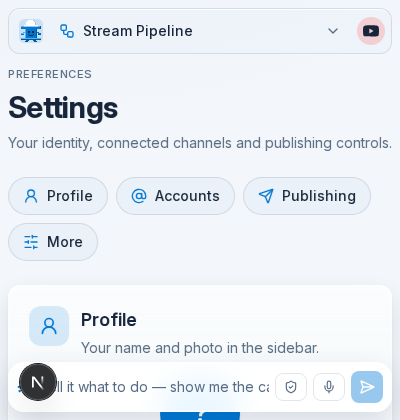
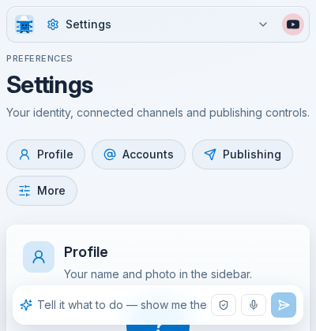
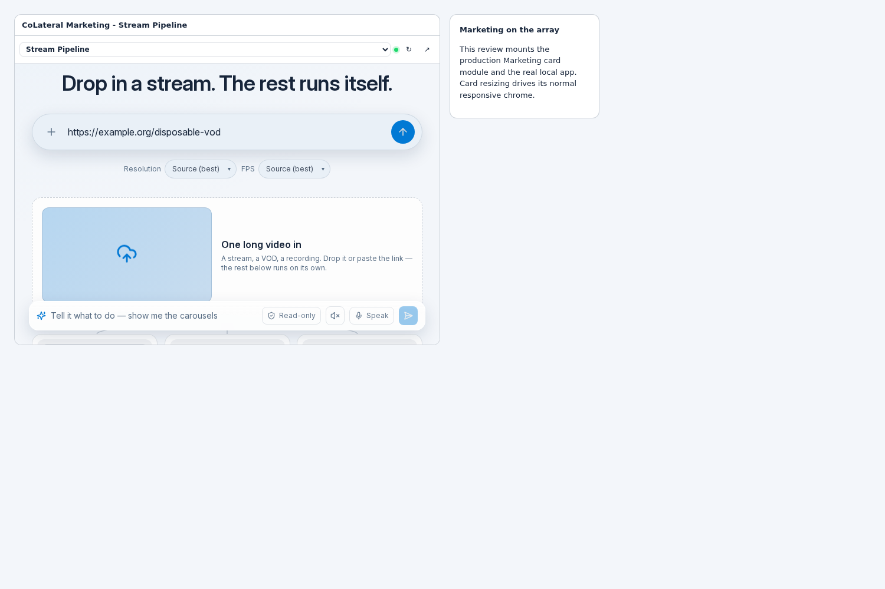
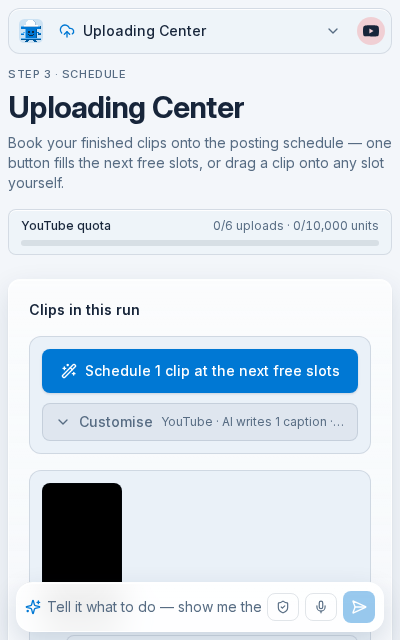

# Marketing UI and CoLateral array integration review

Reviewed 1 October 2026 against capital-command main `9bdf8f2` and CoLateral-AI
main `76e6f93`. The host's subsequent `0366072` change only affects the public
Arcade website and does not overlap these changes. Work was divided between
shell/navigation, workflows/data recovery, and the host card/bridge, followed
by an integrated browser review and correction loop.

## Changes and evidence

| Area | Observed problem | Executed fix and verification |
| --- | --- | --- |
| Host navigation | Startup requests could expire unsent; route acceptance was treated as arrival | Queue until ready, bounded hello retries, verify actual route arrival, preserve the iframe on failed navigation; host regression suites and real cross-origin browser checks |
| Array sizing | Outer world dimensions did not describe the app viewport under zoom | Measure the remaining iframe stage; verify bare, compact, full, short-wide, and inverse-zoom layouts |
| Appearance | Startup/reload could miss current host appearance | Resend live palette and chrome on ready; verify Office Blue, Dark and Nord transitions against the host's actual accent |
| Compact navigation | Duplicate app navigation in bare and compact cards; Settings labelled as Pipeline | Hide the redundant hosted narrow header; correct current route; current-page semantics, ArrowDown entry, Escape dismissal and focus return |
| Assistant | Whole-window centering crossed the sidebar; hidden footer also removed clearance | Align to both content edges; independent bottom clearance; verify expanded/collapsed rails and short panes |
| Sidebar | Short wide panes squeezed navigation; long update failure text escaped the rail | Scroll the whole rail on short windows; constrain status text and retain its full tooltip |
| Startup | Saved data could be mistaken for an empty new workspace | Wait for a valid bootstrap before mounting pages; persistent loader/error/retry; refuse malformed success payloads |
| First run | Open Settings returned to setup; failed profile save could continue | Permit the offered Settings route; accessible link; failed save stops setup completion |
| Workflow recovery | Failed reads could look like empty libraries or leave fleeting notices | Bounded reads, validated responses, visible Retry, retained last loaded data, and matching agent surface status/actions |
| Calendar | Previous-period events and false empty states; hidden sources looked unscheduled | Cancel stale period reads, associate data with its range, gate all views, explain filtered results and offer Show all sources |
| Longform | Selected processing/error projects could disappear; compact library overflow | Show selected summaries before detail readiness, recover detail errors, and bound library grids |
| Uploading Center | Partial account data could imply scheduling readiness; populated 400px pane expanded to 455px | Gate scheduling on readiness, scope channel responses to the selected account, use explicit zero-minimum grid tracks and shrinking fields, wrap agenda actions; populated panes now fit at 400x420 and 400x640 |

The review found further defects during integration, including an omitted right
gutter, duplicate React route keys, false calendar empty states, and the
populated Uploading Center overflow. Each was corrected and its affected check
repeated. No known defect remains in the browser matrix completed here; this is
an evidence-based completion statement, not a claim of a universal 10/10 score.

## Validation

- Type checking passed on the final implementation.
- 205 app assertions passed across 14 focused test files: themes, host
  appearance, protocol/routes/surfaces, voice state, workflow recovery,
  publishing defaults/bulk/clip cards, calendar aggregation/planning and
  pipeline state/streams.
- Seven host regression/style suites passed through
  `npm run validate -- --focus=capitalCommand`.
- The production build passed with `CIRCLE_NODE_TOTAL=3 node
  node_modules/next/dist/bin/next build`. The repository's default
  `npm run build` Turbopack command failed parsing two esbuild executable
  files. The same two failures reproduced on the unchanged `9bdf8f2` baseline
  with the same installed dependencies; see `baseline-turbopack-build.txt`.
  This review does not change the release command.
- All 32 page routes, including legacy redirects, fit a 400px pane. Deep
  interactive checks covered the seven main screens, initial/malformed loads,
  profile-save failures, six workflow HTTP failures and Retry, retained clips,
  calendar period/filter recovery, populated Longform/Uploading Center,
  keyboard navigation, desktop geometry, live host routes/inputs/themes,
  native iframe reload, and array zoom.
- Final browser checks reported no page exceptions, hydration errors,
  duplicate-key warnings, or update loops. Fault-injection HTTP errors and
  absent synthetic media produce expected resource diagnostics.

## Before and after







Additional startup, failure, retained-data, calendar, short-pane, zoom, and
desktop evidence is in `images/`; browser run records are alongside this file.

## Reproducing the browser pass

Use isolated checkouts of the paired app and host changes, Node 20+, Playwright
and Chromium. Install the app dependencies and produce its standard Next build.
The harness mounts the real host card and the real local Marketing app; it
does not launch the entire signed-in desktop workspace.

```bash
COLATERAL_CHECKOUT=/path/to/CoLateral-AI \
CHROMIUM_EXECUTABLE_PATH=/path/to/chromium \
QA_APP_MODE=production \
node docs/qa/marketing-ui-2026-10-01/browser-verify.mjs
```

Set `PLAYWRIGHT_MODULE_PATH` if Playwright is installed outside the normal
module search path. `QA_CHECK_FILTER` selects check names. Output and app data
are created in a new temporary directory; `QA_OUTPUT_DIR` can select a dedicated
review directory. Ports 3100 and 5296 must be free. The script initializes only
that disposable first-run workspace and uses read-only synthetic populated
fixtures. Its server guard blocks external fetch/HTTPS/socket requests; the
browser also blocks non-loopback requests. External provider and account calls
are not part of this test.

## Limits and handoff

Windows/Tauri installed-app behavior, microphone recording, real media
processing/export, authenticated accounts and actual publishing were not
exercised. Synthetic populated data proves rendering and recovery, not those
operations. Existing standalone theme preferences remain; the host selects
the embedded appearance.

The workspace orchestrator's existing post-navigation read catch can return
`surface:null` without the read diagnostic. The card now confirms route arrival,
but that separate diagnostic improvement was left to the session owning
`canvasWorkspace.js`. No unrelated array or orchestrator files were changed.

Automatic approval review stopped the initial broad pass over possible
`opencode.ai` contact. The remaining UI checks completed with loopback-only
networking and disposable data. No external provider test was attempted.

These changes are for review. Nothing was merged, released, or installed on
the user's machine.
